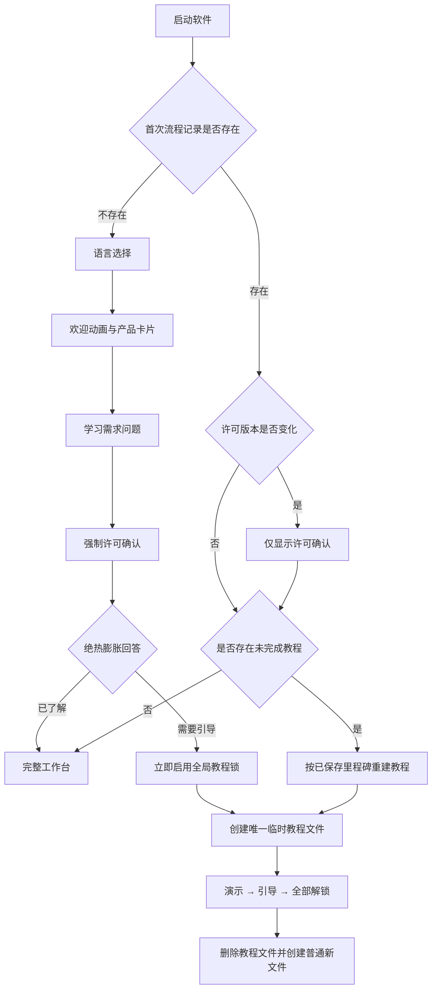

# 首次启动、许可确认与实验学习解锁整体设计

> 状态：颗粒度已确认；第一、第二小版本已通过用户体验验收，第三小版本已实现并通过全量自动验收，待用户体验验收
>
> 确认日期：2026-07-22
>
> 适用范围：桌面版与网页版；当前落地绝热膨胀法实验，并为活塞振动法实验预留扩展能力
>
> 详细实施计划：`docs/archive/implementation-plans/2026-07-22-first-run-consent-and-experiment-learning-implementation-plan.md`

## 1. 背景与问题

当前绝热膨胀法实验文件在创建后会立即进入自由模式，并要求用户选择实验组数。这个入口默认假设用户已经理解软件界面、实验流程和三种模式，导致首次使用时同时暴露过多信息。

本次调整把用户路径改为循序渐进的学习流程：

1. 首次启动时先完成软件语言选择、产品介绍、学习需求确认和许可确认。
2. 不熟悉绝热膨胀法实验操作的用户，立即进入强制的逐步解锁教程。
3. 用户先观看演示，再完成引导，最后解锁自由实验和全部普通文件功能。
4. 已经熟悉操作的用户可直接进入完整软件，不必重复教程。
5. 普通绝热膨胀实验文件从“探索基态”开始，不再在创建时立即询问实验组数。

本设计同时解决许可版本更新、卸载后保留数据、旧文件兼容、多窗口和网页多标签页同步等边界问题。

## 2. 设计目标

- 降低新用户第一次打开软件时的信息负担。
- 把“产品介绍”“用户需求”“许可确认”和“实验学习”拆成职责清楚、可以独立复用的模块。
- 只有用户真正进入自由模式时才要求选择实验组数。
- 建立统一的探索基态，消除“自由模式被当成默认基态”的结构性问题。
- 建立按实验类型独立保存的学习进度，为后续活塞振动法教程留出扩展空间。
- 教程进行期间全局阻断其他实验文件，避免绕过学习流程或产生多份未完成教程。
- 保留旧实验文件、原有参数、历史数据和结果，避免为了兼容建立过度复杂的迁移逻辑。
- 所有关键节点都能在正常退出、异常中断、许可版本变化和多窗口环境下恢复到明确状态。

## 3. 本轮不包含的内容

以下内容明确延期，不属于当前三个小版本的实施范围：

- 产品介绍卡片的正式图文内容；第一版只使用三张占位卡片审核布局和动效。
- “是否熟悉软件总体 UI”的正式问题和对应的全局 UI 强引导教程。
- 活塞振动法实验的正式需求问题和逐步解锁教程。
- 学生、教师等身份区分。
- 演示前的线上讲解视频。
- 撤销和重做系统的全局能力审计；本轮只在临时教程文件中禁用撤销和重做。
- 安装器语言流程改造；软件内语言与安装器语言保持独立。

## 4. 核心术语

### 4.1 首次完整流程

本地不存在已完成的首次流程记录时执行：

```text
语言选择 → 欢迎动画与产品卡片 → 学习需求问题 → 强制许可确认 → 工作台或教程
```

### 4.2 许可单独确认流程

本地已有首次流程记录，但当前许可版本与已同意版本不一致时，只执行许可确认，不重复语言、卡片和问题。

### 4.3 探索基态

探索基态是绝热膨胀法实验文件没有进入演示、引导或自由模式时的内部状态。它不是第四个可见模式按钮。

探索基态允许：

- 调整相机视角和进入仪器聚焦视角。
- 操作可交互仪器。
- 运行必要的物理模拟并查看传感器读数。
- 保留安全限制和真实物理反馈。

探索基态禁止：

- 建立实验批次或询问组数。
- 写入正式实验记录、用户操作记录或过程控制台日志。
- 生成实验报告、计算结果或正式数据表。
- 把探索操作写入演示、引导或自由模式的数据链。

### 4.4 正式模式

正式模式只有三种：演示、引导、自由。用户进入正式模式后才启动对应的流程控制、数据记录、计算和结果模块。

### 4.5 临时教程文件

系统为逐步解锁流程创建的唯一、临时、受保护绝热膨胀法实验文件。它不是普通实验文件，不进入用户的长期文件列表，完成教程后自动删除。

## 5. 总体启动决策



启动优先级固定为：

1. 存储初始化和安全恢复。
2. 首次完整流程或许可单独确认。
3. 恢复未完成教程。
4. 恢复普通工作台。

许可版本变化与未完成教程同时存在时，先完成许可确认，再恢复教程里程碑。

## 6. 首次完整流程

### 6.1 整体外观

- 首次流程覆盖软件标题栏以下的全部 16:9 工作区。
- 标题栏继续显示软件图标、软件名称、最小化、最大化和系统关闭按钮。
- 界面沿用现有工程软件的简洁风格、边框、颜色、排版和控件密度，不新增仪表盘式视觉语言。
- 首次流程尚未完成前，不初始化可操作的工作台内容，也不在背景暴露实验文件。

### 6.2 语言页

- 当前只显示简体中文、繁体中文和 English。
- 全新用户优先匹配 Windows 或浏览器语言；无法匹配时使用简体中文。
- 检测到旧版软件语言设置的老用户，默认选中原有软件语言。
- 安装器语言不参与软件内语言判断，也不需要修改安装器。
- 用户选择语言后，当前首次流程立即切换语言。
- 语言页只有“下一步”，没有“上一步”。
- 在用户同意许可前，语言选择只保存在当前内存草稿中。

### 6.3 欢迎动画与产品卡片

- 从语言页点击“下一步”后，先播放一次简短欢迎动画，再淡入产品卡片。
- 欢迎动画在同一次首次流程会话中只播放一次。
- 从卡片页返回语言页，再次进入卡片页时直接显示卡片，不重复欢迎动画。
- 第一版使用三张占位卡片，不在本轮定义正式产品文案和插图。
- 卡片每 5 秒自动切换，最后一张后回到第一张，保持循环播放。
- 用户手动切换卡片后，从当前卡片重新计算 5 秒。
- 左右两侧使用圆形尖角按钮切换上一张和下一张。
- 底部中央显示三个小型页码指示点。
- 卡片页左下角始终显示“上一步”，右下角始终显示“下一步”。用户可以不等待轮播完成，直接进入问题页。
- 鼠标悬停、键盘焦点进入卡片、页面隐藏或最小化时暂停轮播。
- 系统请求“减少动态效果”时，停止自动轮播并缩短过渡动画；不新增软件内独立设置。

### 6.4 学习需求问题页

架构保留三个独立问题槽位：

1. 是否了解软件总体 UI 与使用逻辑。
2. 是否了解本软件绝热膨胀法实验的操作逻辑。
3. 是否了解本软件中活塞振动法实验的操作逻辑。

本轮只暴露第二个问题，另外两个问题及其 UI 不显示。

当前正式文案：

> 您是否了解本软件绝热膨胀法实验的操作逻辑？

辅助说明：

> 请根据您是否能够使用本软件完成模式选择、仪器操作、数据记录与结果处理进行选择。

选项：

- 是，我已了解
- 否，我需要引导

规则：

- 默认不选中任何答案。
- 必须明确选择后才能点击“下一步”。
- 返回卡片页再进入问题页，保留本轮答案。
- 点击许可页前仍然只保存内存草稿。
- 用户完成逐步解锁教程后，这个答案自动更新为“是，我已了解”，避免设置页显示与实际进度矛盾。

### 6.5 许可确认页

许可确认复用现有权限、数据访问、网络访问、第三方开源许可和软件使用边界主文档，不要求用户逐一打开许可证全文。

全流程中的许可窗口显示在产品首次流程背景之上；许可版本单独更新时显示在中性的全屏进入背景之上。

主文档规则：

- 15 秒计时在许可主界面显示后立即开始，不等待用户滚动到底部。
- “计时完成”和“主文档至少滚动到底部一次”是相互独立的两个条件。
- 两个条件同时满足后，“我已阅读并知悉”按钮才可点击。
- 计时只在许可页面可见时累计；页面隐藏、浏览器标签页进入后台或桌面窗口最小化时暂停。
- 窗口失去焦点但仍然可见时不暂停。
- 用户进入页面内部的许可证详情时，计时继续，不重置、不暂停。
- 返回主文档后保留原滚动位置、已到底状态和累计时间。

固定底部操作栏显示：

- “已阅读至文档底部”的完成状态。
- “已完成 15 秒阅读时间”的完成状态或剩余秒数。
- 次要按钮“不同意并退出”。
- 主按钮“我已阅读并知悉”。

许可窗口不提供返回上一步、右上角关闭按钮、Esc 关闭或点击遮罩关闭。系统标题栏关闭按钮仍可退出整个软件。

桌面版选择“不同意并退出”后安全退出软件。网页版进入全屏阻断页并尝试关闭当前标签页；浏览器无法关闭时保持阻断。刷新或下次访问后仍可重新进入许可流程。

用户拒绝许可或在许可完成前退出时：

- 不保存本轮语言草稿。
- 不保存学习需求答案。
- 不保存首次流程完成状态。
- 不修改已有实验文件和已有学习进度。

用户选择“是，我已了解”并完成许可后：

- 存在旧工作区记录时，按原有工作区恢复规则进入已有文件状态。
- 不存在任何实验文件时，进入现有的零文件工作台，不自动创建实验文件。
- 只有完成强制教程时，系统才会按教程交接规则自动创建一份新的普通绝热膨胀法实验文件。

## 7. 本地记录与触发规则

### 7.1 持久化记录

建立一个全局、带结构版本的本地体验档案，至少包含：

- 首次完整流程是否已完成。
- 已同意的许可人工版本号。
- 当前软件语言或首次流程提交语言。
- 各需求问题的已提交答案。
- 每个实验的学习里程碑。
- 当前是否存在全局活动教程及其实验类型。

首次流程草稿不写入该档案。只有用户完成许可确认后，才一次性提交语言、需求答案、许可版本和初始学习状态。提交中断时，以完整体验档案为权威恢复，不允许出现“答案已保存但许可未确认”的半完成入口。

### 7.2 许可版本

- 许可版本使用人工维护的独立版本号，不直接等同于软件版本号。
- 发布检查必须验证许可正文是否发生实质变化；有变化时人工提升许可版本。
- 许可版本变化只触发许可确认，不重走语言、欢迎动画、卡片和问题。
- 同意新许可后继续原本的工作台或教程状态。

### 7.3 卸载与重装

- 桌面卸载器选择保留数据时，体验档案、许可确认和学习进度随数据保留；重新安装后按原状态继续。
- 桌面卸载器选择删除数据时，体验档案随应用数据删除；重新安装后重新执行首次完整流程。
- 网页版清除站点数据后等同于本地记录不存在。
- 普通关闭软件、重启系统或更新程序不会重复首次完整流程。

## 8. 可扩展的实验学习模型

学习状态按实验类型独立保存，而不是把绝热膨胀逻辑写死在首次流程中。

每个实验至少有三个里程碑：

| 里程碑 | 已开放模式 | 尚未开放模式 |
|---|---|---|
| 演示阶段 | 演示 | 引导、自由 |
| 引导阶段 | 演示、引导 | 自由 |
| 完全解锁 | 演示、引导、自由 | 无 |

全局同时只能有一个活动教程。未来同时需要学习绝热膨胀和活塞振动时，由可配置的实验学习队列决定顺序；当前只注册绝热膨胀法，不显示活塞振动相关入口。

选择“是，我已了解”时，该实验直接进入完全解锁状态。选择“否，我需要引导”并同意许可后，立即激活该实验教程，不等待用户第一次手动新建文件。

## 9. 全局教程锁与临时文件

### 9.1 启动教程

激活教程时必须先：

1. 安全保存所有正在打开的普通实验文件。
2. 关闭其他工作台窗口，只保留教程所在窗口。
3. 禁止创建新的工作台窗口。
4. 把普通文件转为可恢复但当前不可访问的状态。
5. 创建并打开唯一的临时教程文件。

桌面端通过全局窗口协调保证只有一个教程窗口。网页版通过跨标签页同步锁保证只有一个教程所有者，其余标签页显示阻断状态；所有标签页都不能绕过教程打开普通文件。

### 9.2 临时教程文件属性

- 显示名称：“绝热膨胀学习实验（临时）”。
- 文件树中显示小型锁定标记，不显示未保存标记。
- 不能重命名、关闭、删除、导出、另存或复制为普通文件。
- 教程期间文件树只显示这一份文件。
- 顶部“新建实验文件”和“打开已有实验文件”禁用。
- 通过快捷键、最近文件、文件树双击、拖放、系统关联或其他入口尝试新建或打开文件时，统一在现有消息位置提示“完成当前学习流程后即可使用其他实验文件”。
- 用户只能完成教程或退出软件。

教程文件本身不作为普通文件长期保存。持久化层只保存学习里程碑；重新启动时根据里程碑创建一份新的、初始状态的教程文件。

### 9.3 教程期间可用菜单

继续允许：

- 软件语言、主题、性能和音频等普通设置。
- 帮助、关于和许可查看。
- 系统最小化、最大化和退出。

暂时禁用：

- 撤销和重做。
- 新建、打开、关闭、重命名、删除、导入、导出和另存实验文件。
- 新建窗口。
- 结果、数据表、计算、实验参数和其他可能绕过教程流程的实验窗口开关。
- “重新观看产品介绍”“重新选择学习需求”和“重置学习进度”。

## 10. 绝热膨胀教程流程

### 10.1 教程开始

临时文件创建后显示阻断式提示：

> 您当前只可以使用演示模式。

用户通过确认按钮、点击遮罩空白处或 Enter 关闭提示；Esc 无效。关闭提示后自动进入演示模式。

初始只显示“演示”按钮。“引导”和“自由”按钮完全隐藏，不显示灰色锁定占位。

### 10.2 演示完成并解锁引导

首次完整观看演示后：

1. 保存“引导阶段”里程碑。
2. 模式栏向右延展并出现“引导”按钮。
3. 自动切换到全新的引导模式初始状态。
4. 暂停引导流程计时和强提醒。
5. 显示阻断式提示：“您已经解锁了引导模式”。
6. 用户确认、点击遮罩或按 Enter 后，才正式启动引导计时和强提醒。

系统启用“减少动态效果”时，延展动画改为短暂淡入。

### 10.3 引导阶段重看演示

- 引导已经开放后，用户可以重新进入演示模式。
- 正在进行的引导存在未完成进度时，切换到演示前提示“当前引导进度将被重置”。
- 重新演示完成后仍停留在演示模式，不重复解锁动画、阻断提示或里程碑日志。
- 用户可点击演示模式的退出按钮返回探索基态，也可以直接点击“引导”进入全新引导流程。
- 演示和引导之间只要当前模式存在未完成进度，直接切换前都提示该进度会被清除。

### 10.4 引导完成并完全解锁

- 引导结果正确与否继续使用现有引导计算结果判定。
- 结果不正确时保持引导阶段，允许用户按现有流程重试，不开放自由模式。
- 结果正确时保存“完全解锁”里程碑，并把需求答案更新为“是，我已了解”。
- 删除临时教程文件。
- 恢复普通文件可访问状态，但不自动重新打开旧文件。
- 自动创建一份全新的普通绝热膨胀法实验文件。
- 新文件停留在探索基态，不自动进入自由模式，也不弹组数选择。
- 显示阻断式提示，说明自由模式和全部模式已解锁、旧文件和新建文件功能已经恢复。
- 用户关闭提示后自行选择演示、引导或自由模式。

### 10.5 教程里程碑日志

临时教程文件的控制台严格只显示三条里程碑日志：

1. 演示教程开始。
2. 引导模式解锁。
3. 自由模式和全部模式解锁。

不记录普通用户操作、错误操作、安全提示、模式重放或恢复动作。重启后日志由当前里程碑重建，不重复追加。

## 11. 教程退出与恢复

### 11.1 正常关闭

演示或引导尚未完成时关闭软件，显示阻断确认：

> 本模式尚未完成，下次进入将从本模式第一步重新开始。

操作为“退出软件”和“继续教程”。

### 11.2 下次启动

- 演示阶段从演示第一步重新开始。
- 引导阶段从引导第一步重新开始，不退回演示阶段。
- 引导已经解锁但用户关闭前正在重看演示时，仍恢复到待完成的引导模式。
- 启动时显示“继续完成演示模式”或“继续完成引导模式”的阻断提示。
- 确认后自动进入相应模式第一步。
- 不重复解锁动画和里程碑日志。

强制结束或崩溃无法显示退出确认，但下次仍按已保存里程碑恢复。

## 12. 探索基态与三种正式模式

### 12.1 状态边界

| 状态 | 物理交互与传感器 | 正式数据记录 | 计算与报告 | 退出或重开策略 |
|---|---|---|---|---|
| 探索基态 | 开启 | 关闭 | 关闭 | 始终为全新默认现场 |
| 演示模式 | 开启，按演示流程控制 | 仅本轮临时数据 | 按现有演示流程 | 退出或切换后清除；再次进入从头开始 |
| 引导模式 | 开启，按引导流程约束 | 仅本轮临时数据 | 按现有引导流程 | 退出或切换后清除；再次进入从头开始 |
| 自由模式 | 开启 | 开启 | 开启 | 退出或切换时保存自由会话；再次进入恢复 |

### 12.2 新文件与旧文件打开

- 新建普通绝热膨胀法文件后停留在探索基态。
- 普通软件重启后，所有普通绝热膨胀法文件也先进入探索基态。
- 进入任一正式模式时，不继承探索现场；使用该模式的全新默认引擎状态，或恢复自由模式自己的已保存会话。
- 退出任一正式模式后创建全新的探索现场，不恢复进入正式模式前的相机、仪器和物理状态。

### 12.3 模式切换

- 模式按钮只显示演示、引导和自由，不显示“探索”。
- 点击当前模式的退出按钮回到探索基态。
- 演示或引导存在未完成进度时，切换到另一模式必须确认本轮进度将清除。
- 已完成的演示或引导可以直接切换。
- 从自由模式切换到演示或引导时，先保存完整自由会话，不显示数据丢失提示。
- 切回自由模式时恢复自由会话。

## 13. 自由模式批次与退出

### 13.1 首次进入

- 用户第一次点击自由模式时才显示组数选择窗口。
- 组数窗口允许取消；取消后回到探索基态，不建立批次、不产生实验数据。
- 组数确认后，在当前文件内不可修改。

### 13.2 退出和恢复

自由模式退出或切换时保存：

- 固定组数方案。
- 已完成实验组及其数据。
- 当前未完成组的数据和流程状态。
- 计算结果。
- 继续当前实验所必需的仪器与物理状态。

不保存：

- 相机视角。
- 工作台窗口位置和布局。
- 探索基态现场。

普通软件重启后文件先进入探索基态；用户再次点击自由模式时恢复保存的自由会话。

### 13.3 当前组重置

- 批次尚未完成时保留“重置自由实验”图标。
- 重置前显示确认，说明当前未提交组的数据将被清除。
- 重置只影响当前未完成组，组数方案和之前已经完成的组不变。
- 全部实验组完成后隐藏重置按钮，保护已完成文件。

### 13.4 自动进入下一组

- 删除现有“下一组”按钮及其手动交互。
- 当前组完成并关闭电源后，系统立即完成本组提交并自动初始化下一组。
- 在现有消息提示位置显示“第 N 组已完成，已进入第 N+1 组”。
- 该提示不阻断用户，不要求确认。
- 组间交接期间暂时锁定重复关机、模式切换和其他可能产生重复提交的动作。

### 13.5 最后一组

- 最后一组完成并关机后不建立下一组。
- 显示“全部实验组已完成，正在生成计算结果”。
- 数据提交完成后自动打开现有计算结果窗口。
- 全部完成的自由实验文件进入只读完成状态；再次进入自由模式只查看原有数据和结果。
- 用户需要重新实验时必须新建普通实验文件。

## 14. 设置中的学习与引导

设置窗口新增“学习与引导”分区，当前包含：

### 14.1 重新观看产品介绍

- 只播放欢迎动画和产品卡片。
- 不进入语言页、学习问题页或许可页。
- 不修改学习需求、许可和教程进度。
- 从普通正式模式进入时暂停实验时间和交互，结束后完整恢复。
- 教程进行期间禁用。

### 14.2 重新选择学习需求

- 只显示已正式开放的需求问题。
- 从“是”改成“否”时显示后果确认：现有实验文件会暂时无法打开，但不会被删除、清理或丢失；完成教程后恢复访问。
- 确认后立即安全保存并关闭普通文件，创建临时教程文件。
- 教程进行期间禁用。

### 14.3 重置绝热膨胀学习进度

- 不进入问题页，直接显示后果确认。
- 确认后把绝热膨胀学习状态重置到演示阶段，立即创建教程文件。
- 已有普通文件数据保持不变，但教程完成前不可访问。
- 教程进行期间禁用。

### 14.4 内部测试入口

预留仅测试构建可见的“模拟首次启动”入口：

- 不删除任何实验文件。
- 清除首次流程、许可确认和学习状态。
- 下次启动完整体验语言、卡片、问题、许可和教程锁定。
- 正式发行构建隐藏该入口。

## 15. 多窗口与网页多标签页

### 15.1 桌面版

- 激活教程前请求所有工作台完成持久化。
- 持久化成功后关闭其他工作台窗口，只保留教程窗口。
- 教程期间主进程拒绝新建窗口请求。
- 其他窗口保存失败时不进入教程删除或替换阶段，显示“重试”与“退出软件”。
- 教程完成后恢复新建窗口能力；旧窗口命名空间和文件记录继续保留。

### 15.2 网页版

- 使用跨标签页消息同步全局教程锁和体验档案变化。
- 只有一个标签页持有教程执行权；其他标签页显示阻断页。
- 教程所有者标签页关闭后，下一次打开或刷新时按里程碑重新建立教程，不保存中间步骤。
- 许可拒绝后刷新页面仍回到许可确认，不永久封禁用户。

## 16. 旧文件兼容

兼容原则是“保留实验内容，允许瞬时状态归一化”。

- 保留旧文件的名称、类型、公共参数、自由实验批次、历史记录、历史结果和可安全读取的模式数据。
- 旧文件升级后统一从探索基态打开，不自动恢复旧版本正在运行的正式模式。
- 旧自由模式会话可安全恢复时保存为自由模式会话，用户点击自由模式后继续。
- 无法安全恢复的动画、计时器、焦点视角和未完成演示/引导步骤回到稳定初始状态。
- 迁移失败时保留原始记录并进入现有安全恢复流程，不清空文件。
- 教程锁定期间旧文件只是隐藏和不可访问，不删除、不重写、不改变它们自己的解锁或数据状态。

## 17. 阻断提示与关闭规则

教程的三次里程碑提示都采用同一交互：

1. 您当前只可以使用演示模式。
2. 您已经解锁了引导模式。
3. 您已经解锁了自由模式和全部实验功能。

共同规则：

- 阻断当前实验时间和交互。
- 显示明确的“确认”按钮。
- 点击遮罩空白处或按 Enter 也可确认。
- Esc 不可关闭。
- 不显示右上角关闭按钮。

模式进度清除、学习重置、正常退出未完成教程等有损操作必须使用带后果说明的明确确认窗口，不使用轻量消息替代。

## 18. 错误与恢复策略

教程文件创建、教程里程碑保存、普通文件安全关闭或体验档案提交失败时：

- 不自动跳过教程。
- 不自动解锁下一模式。
- 不删除临时文件或普通文件。
- 不把未完成状态伪装成完成状态。
- 显示阻断错误窗口，只提供“重试”和“退出软件”。

完成教程时采用先保存“完全解锁”里程碑，再移除教程运行态、再创建普通新文件的可恢复顺序。若中间崩溃，下次启动以完全解锁里程碑为准，不重新要求用户完成引导，也不恢复已删除的教程流程。

## 19. 可访问性与动效

- 所有关键按钮具备明确的键盘焦点和可读标签。
- 语言、问题和许可选项使用单选语义。
- 必填问题在未选择时禁用“下一步”，并提供清楚的状态说明。
- 许可条件使用文字状态，不只依靠按钮颜色表达。
- 系统请求减少动态效果时：停止产品卡片自动播放、缩短欢迎和卡片过渡、把模式解锁延展改为短淡入。
- 性能四档不控制减少动态效果；两者职责独立。

## 20. 端到端验收场景

### 20.1 全新且熟悉的用户

- 按系统语言进入语言页。
- 可快速跳过卡片并选择“是，我已了解”。
- 完成许可后进入普通工作台。
- 新建绝热膨胀文件后处于探索基态，不出现组数窗口。
- 点击自由模式后才出现组数选择。

### 20.2 全新且需要引导的用户

- 选择“否，我需要引导”并同意许可后立即创建教程文件。
- 其他文件和窗口被安全关闭并锁定。
- 初始只显示演示按钮，确认提示后自动演示。
- 演示完成后自动进入引导准备态。
- 引导结果正确后删除教程文件并创建新的普通探索文件。
- 旧文件恢复可打开，但不自动重新打开。

### 20.3 教程中断

- 演示中退出后重启，从演示第一步开始。
- 引导中退出后重启，从引导第一步开始。
- 引导阶段重看演示时退出，重启仍进入引导。
- 不重复里程碑日志或解锁动画。

### 20.4 许可版本变化

- 已完成首次流程的用户只看到许可确认。
- 拒绝后退出，下次仍可重新确认。
- 同意后直接恢复原工作台或教程里程碑。

### 20.5 卸载与重装

- 选择保留数据后重装，不重复已完成首次流程；许可版本变化时只补许可确认。
- 选择删除数据后重装，重新执行完整首次流程。

### 20.6 自由模式

- 退出自由模式后回到全新探索基态。
- 再次进入自由模式恢复批次、当前组、仪器和实验数据。
- 当前组重置不影响已完成组。
- 关机完成一组后自动进入下一组，无“下一组”按钮。
- 最后一组完成后自动打开计算结果，重置按钮消失。

## 21. 已确认结论

本设计没有待定产品决策。正式卡片内容、全局 UI 教程、活塞振动教程、学生/教师区分和撤销重做范围留到后续独立讨论，不阻塞当前三个小版本。
