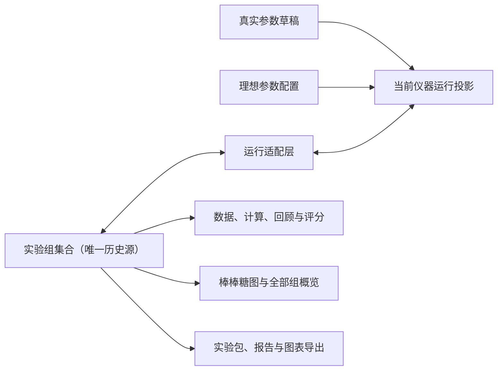

# 绝热膨胀法自由模式多实验组实施方案

> 状态：待用户审核；审核通过前不修改功能代码
>
> 制定日期：2026-07-27
>
> 产品决策基线：`docs/archive/historical-specs/2026-07-25-heat-capacity-free-multi-group-design.md`
>
> 适用范围：绝热膨胀法自由模式的多实验组、真实/理想方案、计算、评分、过程回顾、图表、持久化、旧文件迁移和三种导出

## 1. 最终目标

在不重写现有绝热膨胀物理引擎的前提下，把当前“每种方案只有一个批次槽位”的结构升级为“一个实验文件包含多个独立实验组”的结构，并完整打通以下能力：

1. 同一文件可连续创建多个真实实验组和理想实验组，且同一时间最多只有一个未完成实验组。
2. 用户术语统一为“第 N 组 · 第 M 次实验”；旧“轮次/组”层级不再出现在用户界面、报告或导出文件中。
3. 真实实验组完成所有实验次数后进入不可跳过的交互式计算，完成后形成 75 分操作均分 + 25 分计算分的本组总分。
4. 理想实验组完成实验次数后由系统自动处理，不出现交互式计算和任何评分。
5. 数据表、计算、过程回顾、评分和图表都由同一个“当前查看组”控制，并与正在运行的实验组彻底分离。
6. 每组完成第 3 次正式实验后显示棒棒糖图；另提供全部实验组结果概览。
7. 支持`导出实验包`、`导出报告`和`导出图表`，覆盖完整实验文件，而不是只覆盖当前真实/理想槽位。
8. 旧文件无损迁移；历史 trace 不再因“每种方案最近 7 次”的旧上限而被静默删除。

本方案不包含：历史实验组删除/重命名/复制、真实与理想实验组自动配对、平均过程曲线、实验组数量硬上限、ZIP 打包、版本发布和安装包制作。

## 2. 当前基线与实施约束

### 2.1 项目类型

- 前端与状态层：React + TypeScript + Vite。
- 桌面端：Electron。
- 正式报告和图表：Python 导出器。
- 测试：项目自有 TypeScript 测试运行器，支持按测试文件或名称筛选。

### 2.2 当前工作区状态

- 当前分支：`codex/heat-capacity-calculation-workflow`。
- Git 已初始化，`.gitignore` 已覆盖 `node_modules`、`dist`、`release`、`coverage`、`.codex`、Playwright 临时目录、`output` 和 `tmp` 等生成内容，不需要重新初始化或改动 Git 基础配置。
- 工作区已有未提交改动，主要属于此前已授权的 U012、75+25 评分、过程回顾和首次启动动态演示工作。它们作为本次实现的基线保留，不回滚、不覆盖、不混入无关重构。
- 本计划文档和既有设计决策文档应纳入版本管理；依赖、构建产物、导出结果、临时截图和缓存继续保持忽略。

### 2.3 固定预览与验证入口

所有代码或用户界面改动后使用固定地址：

```powershell
npm.cmd run dev -- --host 127.0.0.1 --port 5174 --strictPort
```

预览地址：`http://127.0.0.1:5174/`

临时相机采集工具继续只使用 `5184`，不得占用或替代正式预览端口。

## 3. 总体架构

### 3.1 单一权威数据源

新增一个文件级“自由模式实验组集合”，作为实验组历史、当前执行组和当前查看组的唯一权威数据源。

现有真实域和理想域继续保留，用于：

- 分别保存真实参数草稿和理想参数配置；
- 承载当前方案的物理状态、传感器状态和仪器运行缓存；
- 复用现有物理引擎、记录链路和控制逻辑。

现有顶层 `batch / trials / traceStore` 字段在第一阶段仍保留为“当前实验组运行投影”，但不再独立保存历史。新增单一适配层负责：

1. 把当前实验组装载到现有运行字段；
2. 在受控状态变更后把运行字段写回当前实验组；
3. 切换实验组时先提交旧投影，再装载新投影；
4. 持久化时以实验组集合为准，运行镜像只作为可恢复的当前现场保存；
5. 开发环境中校验集合与运行镜像的一致性，发现漂移立即报错，而不是静默选择一份数据。



### 3.2 建议的数据结构

新增领域文件：

```text
src/domain/heatCapacity/heatCapacityFreeExperimentGroupModel.ts
```

概念结构如下，最终命名可按现有代码风格微调，但字段语义不能变化：

```ts
type HeatCapacityFreeExperimentGroupStatus =
  | 'draft'
  | 'collecting'
  | 'awaiting-real-calculation'
  | 'awaiting-ideal-processing'
  | 'completed'
  | 'legacy-incomplete-readonly';

interface HeatCapacityFreeExperimentGroupCollectionV1 {
  version: 1;
  groups: HeatCapacityFreeExperimentGroupRecordV1[];
  currentGroupId: string | null;
  viewedGroupId: string | null;
  pendingNextScheme: 'real' | 'ideal';
  lastViewedTrialIdByGroupId: Record<string, string | null>;
  nextSchemeGroupNumber: { real: number; ideal: number };
  nextGlobalOrder: number;
  capacityEstimate: {
    bytes: number;
    measuredAtMs: number | null;
  };
}

interface HeatCapacityFreeExperimentGroupRecordV1 {
  version: 1;
  id: string;
  scheme: 'real' | 'ideal';
  schemeGroupNumber: number | null;
  globalOrder: number | null;
  status: HeatCapacityFreeExperimentGroupStatus;
  targetExperimentCount: 3 | 4 | 5 | 6 | 7;
  gasType: HeatCapacityFreeGasType;
  parameterSnapshot: HeatCapacityFreeConfigSnapshot | null;
  runSeries: {
    batch: HeatCapacityFreeBatchState;
    trials: HeatCapacityFreeTrial[];
    traceStore: HeatCapacityFreeTraceStore;
  };
  calculation: {
    kind: 'real-interactive';
    session: HeatCapacityCalculationWorkflowSession;
  } | {
    kind: 'ideal-automatic';
    result: HeatCapacityFreeProcessingResult;
  } | null;
  finalScore: HeatCapacityFreeBatchScore | null;
  scoringVersion: HeatCapacityFreeScoringVersion;
  createdAtMs: number;
  startedAtMs: number | null;
  acquisitionCompletedAtMs: number | null;
  completedAtMs: number | null;
  legacyCompatibility: HeatCapacityFreeLegacyCompatibilityRecord | null;
}
```

`runSeries.batch` 是对当前内部结构的兼容包装；它表示“本组内的 3～7 次实验”，不再被用户称为批次。新代码不得把它当成文件级历史集合。

### 3.3 必须始终成立的数据不变量

1. `groups` 中 ID 唯一，正式组号在同一方案内唯一且只增不减。
2. `draft` 组的正式组号和全局顺序都为 `null`；第一次成功通电时才原子分配。
3. 除 `legacy-incomplete-readonly` 外，最多只有一个组处于未完成状态。
4. `currentGroupId` 指向当前草稿、正在采集、等待处理或刚完成且尚未新建下一组的组。
5. `viewedGroupId` 只控制结果展示，不改变仪器运行、参数锁定或当前组。
6. 已完成真实组必须拥有已完成的交互式计算和冻结评分；已完成理想组不得拥有交互式答题或评分。
7. 已完成历史组的参数、实验次数、记录、trace、计算/自动结果和评分不可被后续操作修改。
8. 每个 trial 和 trace 引用只能属于一个实验组，不允许跨组引用。
9. 目标实验次数始终为 3～7；增加次数不改变满分。
10. 所有序号、完成状态和统计值都从领域模型推导，UI 不自行计数或补造结果。

### 3.4 当前组与当前查看组

- `currentGroupId`：仪器真正执行的实验组；完成后仍指向该组，直到用户确认创建下一组。
- `viewedGroupId`：所有结果区域共同查看的实验组；可在实验进行时指向任意历史组。
- 用户确认下一组前，只更新 `pendingNextScheme`，不创建新组、不切换结果、不改变 `currentGroupId`。
- 用户确认下一组后，创建新的无编号草稿，同时把 `currentGroupId` 和 `viewedGroupId` 指向草稿；所有结果区域因此统一显示暂无数据。
- `lastViewedTrialIdByGroupId` 作为持久化的查看偏好保存。刷新或重开文件后，先恢复该组上次查看的实验次数；没有记录时选择第 1 次实验。

## 4. 生命周期与状态转换

### 4.1 第一组和下一组共用创建规则

现有组数窗口改造成可复用的实验组创建窗口：

- 文件尚无实验组时：标题为`开始第一组实验`。
- 当前组已完成时：标题为`开始下一组实验`。
- 两种情况都选择 3～7 次实验；下一组默认沿用上一组次数。
- 确认后只创建无编号草稿，不立即冻结参数。
- 取消不改变任何文件状态。

### 4.2 第一次成功通电

第一次从断电状态成功切换到通电状态是唯一正式开始边界。该事务必须一次完成：

1. 核对当前草稿仍可执行；
2. 按草稿当前方案分配方案内组号和全局顺序；
3. 冻结参数方案、气体类型和完整参数快照；
4. 把状态改为 `collecting`；
5. 初始化第 1 次正式实验的运行现场和 trace；
6. 写回集合，再返回更新后的运行投影。

现有 U0、打气等路径中可能再次调用参数冻结函数；这些调用只能做幂等校验，不能再分配组号或改变快照。切换视角、展开侧栏、断电误触和查看结果都不得触发正式开始。

### 4.3 本组内推进

- 每次实验成功关机并完成记录后，把 trial 和 trace 提交到当前实验组。
- 尚未达到目标次数时，初始化下一次实验，进度改为`第 M / N 次实验`。
- 达到目标次数时，不再自动初始化下一次：
  - 真实组进入 `awaiting-real-calculation`，立即建立不可关闭的交互式计算会话；
  - 理想组短暂进入 `awaiting-ideal-processing`，系统使用统一计算公式生成自动结果，成功后直接进入 `completed`。
- 理想组不得创建或持久化学生答题状态；自动结果与理论比较直接保存到本组。

### 4.4 真实组计算完成

完成计算按钮的事务顺序：

1. 完成并冻结计算会话；
2. 按本组所有正式实验生成各次操作分；
3. 以完整精度计算本组操作均分；
4. 生成并冻结 25 分计算明细；
5. 生成本组总分和评分版本快照；
6. 把本组状态改为 `completed`；
7. 自动展开右侧栏，使下一组方案重新可选；
8. 聚焦进度位置切换为`开始下一组实验`。

该事务完成前，模式切换、关闭计算、跳过计算、开始下一组和重新开始本组均不可用。

### 4.5 放弃与重新开始

- `draft`：菜单显示`放弃本组草稿`。确认后删除该空白草稿，不消耗正式组号，`currentGroupId` 和 `viewedGroupId` 返回最近查看的已完成组，右侧栏保持展开。
- `collecting`：菜单显示`重新开始本组`。确认后保留组 ID、正式组号、全局顺序和冻结参数，清空本组 trial、trace、活动尝试和计算草稿，重新从第 1 次实验开始。
- `awaiting-real-calculation`、`awaiting-ideal-processing`、`completed` 和 `legacy-incomplete-readonly`：不提供重新开始。
- 两种操作都使用软件统一确认弹窗；取消确认零写入。

### 4.6 状态矩阵

| 状态 | 方案可切换 | 参数可编辑 | 可放弃 | 可重开 | 可开始下一组 | 结果默认 |
| --- | --- | --- | --- | --- | --- | --- |
| 无实验组 | 是 | 是 | 否 | 否 | 创建第一组 | 暂无数据 |
| `draft` | 是 | 是 | 是 | 否 | 否 | 暂无数据 |
| `collecting` | 否 | 否 | 否 | 是 | 否 | 当前阶段数据 |
| `awaiting-real-calculation` | 否 | 否 | 否 | 否 | 否 | 强制计算 |
| `awaiting-ideal-processing` | 否 | 否 | 否 | 否 | 否 | 自动处理中 |
| `completed` | 仅选择下一组方案 | 否 | 否 | 否 | 是 | 本组完整结果 |
| `legacy-incomplete-readonly` | 不适用 | 否 | 否 | 否 | 否 | 只读旧版记录 |

## 5. 计算、统计与评分

### 5.1 统一统计函数

不在图表、报告和理想自动处理中分别实现公式。扩展现有计算模型并统一调用：

```text
平均值 = Σγᵢ / n
样本标准偏差 s = sqrt(Σ(γᵢ - γ̄)² / (n - 1))
A 类标准不确定度 uA = s / sqrt(n)
相对误差 = |γ̄ - γ理论| / γ理论 × 100%
```

领域结果增加 `sampleStandardDeviation` 和 `typeAStandardUncertainty`。计算窗口、理想自动结果、棒棒糖图、总览图、报告和导出表格都从同一结果对象取值。

### 5.2 真实实验组评分

沿用已经确认并正在工作区中实现的 75+25 规则：

- 每次实验操作分：打气 15、放气 25、记录链路 30、退回/重录 5，共 75。
- 本组操作均分：本组所有正式实验操作分等权平均，满分 75。
- 本组计算分：修正电压 4、绝对压强 4、各次 gamma 7、平均 gamma 3、样本标准偏差 3、A 类不确定度 2、相对误差 2，共 25。
- 本组总分：操作均分 + 计算分，满分 100。
- 首次正确/有效数字修正/错误后改正/查看答案/无效输入的 100%/80%/60%/20%/0% 折算不变。

实施时只做以下集成与术语修正：

- 把评分输入绑定到当前实验组，而不是方案域的唯一批次；
- 计算项目中的`各组`改为`各次实验`；
- `整批`、`本轮`、`批次总分`改为`本组`；
- 组完成时冻结 `finalScore` 和 `scoringVersion`；
- 历史组优先显示冻结分数，原始证据仍保留用于复核；
- 未完成计算时总分为`待完成`，不是 0 分。

### 5.3 理想实验组

- 使用与真实实验相同的电压修正、压强、gamma 和统计公式。
- 不创建交互式计算窗口，不显示答案状态，不计算操作分、计算分或总分。
- 过程回顾仅显示记录、曲线、关键事件和结果比较；评分区域明确不适用或完全隐藏。

## 6. 图表与结果查看

### 6.1 本组棒棒糖图

新增纯数据图表模型和 React SVG 组件，避免把绘图计算写进大型工作台组件：

```text
src/domain/heatCapacity/heatCapacityFreeGroupChartModel.ts
src/features/heatCapacity/HeatCapacityGroupLollipopChart.tsx
src/features/heatCapacity/HeatCapacityGroupResultsPanel.tsx
```

规则：

- 完成第 3 次正式实验后立即显示；第 4～7 次完成后增量追加。
- 横轴为`第 M 次实验`，纵轴围绕 gamma 数据范围自动留白，不强制从 0 开始。
- 每次 gamma 使用独立棒棒糖点；显示实际均值线、理论参考线和`均值 ± A 类标准不确定度`区间。
- 进行中的组在图题和状态中标记`进行中 · 3/5`。
- 不生成或暗示平均压力/温度过程曲线。

### 6.2 全部实验组结果概览

- 每组一个平均 gamma 点；真实和理想使用固定且可辨识的两套颜色。
- 完成组使用实心点和 A 类不确定度误差棒。
- 已完成至少 3 次、但尚未完成的当前组使用空心点，并显示`进行中 · M/N`。
- 所有组共享理论参考线，不自动连接或配对真实/理想组。
- 横轴按真实、理想分区，并在各区内按组号升序；底层全局顺序保留给明细和导出，不用来打乱用户可见分区。

### 6.3 全局组选择与局部次数选择

新增一个可复用的实验组上下文栏：

```text
src/features/heatCapacity/HeatCapacityExperimentGroupContextBar.tsx
```

放置原则：

- 位于`实验资料与结果`窗口的公共标题/工具栏区域，左侧是`查看实验组`，右侧是导出区域。
- 计算/数据窗口单独打开时复用同一组件和同一 `viewedGroupId`，不创建第二套选择状态。
- 下拉菜单按`真实模拟`、`理想参数`分区，各区组号升序；旧版只读异常记录单独标记。
- 当前查看组与正在执行组不一致时，持续显示`正在实验：真实模拟 · 第 2 组 · 第 3 次实验`。
- 历史查看期间当前组产生新数据时显示`当前实验组有新数据`和`返回当前实验组`，不强制跳转。

过程回顾内部继续保留实验次数选择器，但文案改为`查看实验次数`，且只更新 `lastViewedTrialIdByGroupId`。

### 6.4 结果页结构

扩展现有绝热膨胀材料页签注册表，目标结构为：

```text
实验指引
数据与结果
图表概览
过程回顾
```

- `数据与结果`：U0/U1/U2、修正值、压强、gamma、组统计、真实计算记录或理想自动结果、真实评分。
- `图表概览`：当前查看组棒棒糖图 + 全部实验组结果概览。
- `过程回顾`：当前查看组中单次实验的压力、温度、事件和诊断。
- 历史真实组的计算记录以只读方式打开，不再次触发强制计算。
- 新草稿或无数据组的所有结果页使用统一空状态，不回退显示上一组内容。

## 7. 用户界面改造

### 7.1 聚焦进度控件

保留现有 `HeatCapacityBatchProgress.tsx` 文件以减少无意义改名，但修改其用户语义和属性：

- 采集阶段显示`第 M / N 次实验`。
- 草稿菜单显示`放弃本组草稿`。
- 正式采集菜单显示`重新开始本组`。
- 完成真实计算或理想自动处理后，主入口显示`开始下一组实验`。
- 菜单继续遵守点击外部关闭、Escape 关闭和清理临时确认状态的统一规则。

### 7.2 右侧参数栏

- 用户主动进入自由模式时自动展开。
- 实验组完成时自动展开。
- 确认创建下一组后保持展开。
- 草稿阶段真实/理想方案和参数可修改；第一次成功通电后锁定。
- 完成组阶段的真实/理想选择只写入 `pendingNextScheme`，不改变当前组和当前查看组。
- 聚焦实验时继续沿用现有自动折叠行为。

### 7.3 创建确认窗口

复用并改造 `HeatCapacityBatchSetupDialog.tsx`：

- 字段统一为`实验次数`和`3～7 次`。
- 下一组确认中显示下一组方案和次数。
- 取消不创建草稿、不切换结果、不修改待查看组。
- 确认后所有结果上下文一次切换到新草稿。

### 7.4 计算窗口

- 当前真实组的强制计算窗口不显示关闭入口，Escape 和窗口外点击也不能绕过。
- 历史真实组通过“查看计算记录”进入只读模式，可正常关闭。
- 理想组从入口和状态上都不打开该窗口。
- 计算窗口顶部显示完整定位：`真实模拟 · 第 N 组 · 本组计算`，内部逐项对象改为`第 M 次实验`。

### 7.5 多语言

新增文案必须同时补齐简体中文、繁体中文和英文；简体中文是本次验收主语言。不得只改简体中文后让其他语言回退到旧“轮次/组”语义。

## 8. 持久化、恢复与旧文件迁移

### 8.1 版本策略

计划进行明确版本升级，不向现有严格解码器塞入松散可选字段：

- 新增 `HEAT_CAPACITY_FREE_EXPERIMENT_GROUP_COLLECTION_VERSION = 1`。
- `HEAT_CAPACITY_SCHEMA_VERSION`：1 → 2。
- `HEAT_CAPACITY_FREE_RUNTIME_VERSION`：5 → 6。
- `HEAT_CAPACITY_MODE_SESSION_SCHEMA_VERSION`：2 → 3。
- `HEAT_CAPACITY_MODE_RUNTIME_SNAPSHOT_SCHEMA_VERSION`：1 → 2。
- 如果刷新会话直接保存新的组选择和运行镜像，`WORKBENCH_HEAT_CAPACITY_REFRESH_SESSION_SCHEMA_VERSION`：2 → 3。
- trace 数据结构未改变时保持 trace 版本 6；只有格式字段变化时才升级，不能用版本号掩盖单纯的保留策略变化。

每个版本都需要：严格编码、严格解码、未来版本拒绝、旧版本迁移和持久化往返测试。

### 8.2 新持久化边界

自由模式 V2 载荷分为：

1. 真实/理想参数域：分别保存可编辑参数草稿和必要运行配置；
2. 实验组集合：保存全部组及其历史数据；
3. 当前运行现场：保存可恢复的仪器、活动尝试和时钟状态；
4. 查看状态：保存 `viewedGroupId` 和每组上次查看的实验次数；
5. 兼容记录：仅保存迁移后仍需审计、但不参与新流程的数据。

恢复顺序固定为：解码 → 迁移/归一化 → 校验集合不变量 → 恢复参数域 → 把当前组投影到运行字段 → 做时钟重基准 → 恢复查看状态。任何一步失败都不得部分覆盖原文件。

### 8.3 V1 → V2 迁移矩阵

| 旧状态 | 新状态 |
| --- | --- |
| 真实域有正式数据 | `真实模拟 · 第 1 组` |
| 理想域有正式数据 | `理想参数 · 第 1 组` |
| 旧批次内第 N 组 | 新组内`第 N 次实验` |
| 旧真实采集完成、计算未完成 | 当前真实组，`awaiting-real-calculation` |
| 旧真实计算完成 | 已完成真实组，保留答题与评分 |
| 旧理想采集完成 | 系统自动生成结果后成为已完成理想组 |
| 旧理想交互答题 | 放入`旧版兼容记录`，不评分、不进正式报告 |
| 真实和理想同时未完成 | 当前选中方案继续；另一方案成为`legacy-incomplete-readonly` |
| 空域无正式数据 | 不生成实验组 |

编号和顺序：

- 两种方案分别从第 1 组编号。
- 能从 `configuredAt / startedAt / completedAt` 恢复全局顺序时按最早可信时间排序。
- 时间缺失或互相矛盾时使用稳定迁移顺序，并在兼容元数据中写入`旧版顺序未知`；报告和实验包必须保留该标记。
- 迁移不得删除旧 trace、计算会话、评分证据或参数快照。

### 8.4 历史 trace 与容量策略

修改 `heatCapacityFreeTraceModel.ts`：

- 删除 `FREE_TRACE_MAX_COMPLETED_TRIALS_PER_DOMAIN = 7` 导致的跨组裁剪。
- 保留每次实验 800 个压缩采样点、每分支 320 个事件、每次最多 4 个分支等单次有界策略。
- `compactFreeTraceStore` 只压缩单次实验内部数据，不删除已完成历史实验。

新增容量策略模型，在完成一次实验、完成一组、保存文件和准备创建下一组时重新估算持久化体积，不在每个模拟帧执行昂贵序列化：

- 实验组数达到 20 或估算达到 50 MB：一次性柔性提醒。
- 达到 100 MB：持续容量警告，并建议先`导出实验包`再新建文件。
- 两种提醒都不阻止继续实验，也不自动删除数据。

## 9. 导出与报告

### 9.1 独立的绝热膨胀导出载荷

当前 `workbenchResults.ts` 只真正支持标准模拟和理想气体，绝热膨胀会落入错误的标准模拟分支。新增专用构建器：

```text
src/features/workbench/workbenchHeatCapacityExport.ts
```

载荷包含明确判别字段，例如：

```ts
{
  experimentKind: 'heatCapacity',
  schemaVersion: 1,
  file: { ... },
  groups: { real: [...], ideal: [...] },
  overview: { ... },
  selection: { includedGroupIds: [...] },
  exportStatus: { ... }
}
```

通用 `createWorkbenchExportPayload` 只负责按文件类型分派，不再把绝热膨胀当成标准硬球实验。

### 9.2 三种导出的就绪条件

| 导出 | 用户名称 | 就绪条件 | 范围 |
| --- | --- | --- | --- |
| `completeBundle` | 导出实验包 | 实验文件存在即启用 | 整个自由模式文件，包含空白草稿和未完成组 |
| `report` | 导出报告 | 至少有一个已完成组，或有一个包含可报告数据的未完成组 | 用户勾选的组；默认只选已完成组 |
| `figuresZip`（内部兼容名） | 导出图表 | 至少有一张可生成图 | 所有当前可生成图，不限当前查看组 |

空白草稿没有数据时仍可进入实验包，但不单独生成空 PDF 章节或空图。未完成组只有在至少存在一条正式记录或过程 trace 时才属于“可报告数据”。

### 9.3 实验包目录

继续沿用其他实验的结构化文件夹导出逻辑，不改成 ZIP：

```text
<实验文件名> 实验包/
  manifest.json
  experiment.json
  metadata/
    file.json
    migration.json
  tables/
    experiment-groups.csv
    real/group-001-experiments.csv
    ideal/group-001-experiments.csv
  calculations/
    real/group-001.json
    ideal/group-001-automatic-result.json
  scoring/
    real/group-001.json
  traces/
    real/group-001/experiment-001.json
    ideal/group-001/experiment-001.json
  figures/
    all-groups-overview.pdf
    real/group-001-lollipop.pdf
    real/group-001-experiment-001-pressure.pdf
    real/group-001-experiment-001-temperature.pdf
  report/
    <实验文件名>_实验报告.pdf
```

具体文件名沿用现有导出器的安全字符和时间戳规则。只有实验包包含压缩 trace JSON；正式报告和图表导出不携带原始轨迹 JSON。

### 9.4 报告选择窗口

点击`导出报告`后先显示选择窗口：

- 真实组和理想组分区；各自按组号升序。
- 已完成组默认勾选。
- 有数据的未完成组默认不勾选，可由用户主动纳入，并显示`未完成`。
- 空白草稿不可勾选。
- 确认前不调用桌面导出器；取消无文件写入。

### 9.5 正式 PDF 结构

1. 封面：实验文件名、实验名称、导出时间、真实/理想/未完成组数摘要。
2. 全部实验组结果概览。
3. 全部真实实验组，每组另起一页：
   - 参数快照；
   - 各次 U0/U1/U2、修正量、绝对压强和 gamma 表；
   - 本组棒棒糖图和组统计；
   - 交互计算最终作答、正确值、状态、反馈和得分；
   - 本次操作分、本组操作均分、本组计算分和本组总分；
   - 本组过程图附页。
4. 全部理想实验组，每组另起一页：
   - 参数快照；
   - 各次原始值和系统自动结果；
   - 本组棒棒糖图、统计和理论比较；
   - 本组过程图附页；
   - 不出现答题和评分。
5. 页眉显示文件名和当前实验组，页脚显示页码；未完成状态贯穿章节标题、表格和图题。

Python 导出器复用现有专业图形样式，正文使用单栏可读图，不把多张过程图压成不可读缩略图。完成导出器实现后必须实际渲染 PDF 页面并做视觉检查。

### 9.6 桌面桥接

- 复用现有 IPC 和输出目录策略，不新增不必要的桌面权限。
- `electron/main.cjs` 识别绝热膨胀载荷和三种格式组合。
- 报告继续使用保存文件窗口和原子替换；实验包/图表使用目录选择。
- 导出器返回的 manifest 必须经过现有路径归属、重复文件和越界校验。
- 导出失败只显示错误并保留实验数据，不留下伪成功目录或覆盖用户已有文件。

## 10. 分阶段实施任务

### 阶段 0：保护基线并补齐特征测试

目标：在碰触高风险状态前固定当前行为，区分“既有工作区改动”和“本次多实验组改动”。

任务：

- 记录当前 Git 状态和既有改动范围，不格式化或批量改写重叠文件。
- 运行当前绝热膨胀评分、计算、持久化、trace 和导出测试，记录实施前失败基线。
- 为“首次成功通电才锁定”“当前方案域只有一个批次槽位”“7 次 trace 裁剪”补充特征测试，先证明旧行为再替换。
- 不创建提交、不发布版本；需要提交时另行征得用户同意。

主要测试：

```text
tests/heatCapacity/heatCapacityFreeBatchModel.test.ts
tests/heatCapacity/heatCapacityFreeTraceModel.test.ts
tests/heatCapacity/workbenchHeatCapacityBatchLifecycleGuards.test.ts
tests/heatCapacity/workbenchHeatCapacityCalculationIntegration.test.ts
tests/workbench/workbenchSessionPersistence.test.ts
tests/exporter/workbenchExportPayloads.test.ts
```

验收：现有通过项保持通过；既有失败项被明确记录且没有因本任务扩大。

### 阶段 1：领域模型、统计和只读选择器

新增或修改：

```text
src/domain/heatCapacity/heatCapacityFreeExperimentGroupModel.ts
src/domain/heatCapacity/heatCapacityFreeTrialModel.ts
src/domain/heatCapacity/heatCapacityCalculationModel.ts
src/domain/heatCapacity/heatCapacityFreeGroupChartModel.ts
src/domain/heatCapacity/heatCapacityFreeCapacityPolicy.ts
src/domain/heatCapacity/heatCapacityFreeBatchScoringModel.ts
src/domain/heatCapacity/heatCapacityFreeProcessReviewModel.ts
src/domain/heatCapacity/heatCapacityFreeProcessReviewTypes.ts
```

任务：

- 实现集合创建、严格归一化、不变量校验和纯 selector。
- 实现无编号草稿、正式编号分配、分方案编号和全局顺序。
- 增加完整组统计，统一样本标准差和 A 类不确定度。
- 实现棒棒糖图和全部组概览的纯数据模型。
- 将已有 75+25 评分模型的对象从旧“组”术语切换为“实验次数/本组”。
- 增加冻结评分快照和理想组无评分断言。

新增测试：

```text
tests/heatCapacity/heatCapacityFreeExperimentGroupModel.test.ts
tests/heatCapacity/heatCapacityFreeGroupStatistics.test.ts
tests/heatCapacity/heatCapacityFreeGroupChartModel.test.ts
tests/heatCapacity/heatCapacityFreeCapacityPolicy.test.ts
```

验收：不接 UI 即可用纯函数构造真实 2 组、理想 2 组，证明编号、隔离、统计、评分和图表数据正确。

### 阶段 2：运行适配层与完整生命周期

新增或修改：

```text
src/features/workbench/workbenchHeatCapacityFreeGroupRuntimeAdapter.ts
src/features/workbench/workbenchState.ts
src/domain/heatCapacity/heatCapacityFreeBatchModel.ts
src/domain/heatCapacity/heatCapacityCalculationWorkflowModel.ts
src/features/workbench/workbenchHeatCapacityModeSession.ts
```

任务：

- 把实验组集合接入 `WorkbenchHeatCapacityState`。
- 建立装载/提交当前组的唯一适配层，替代散落的真实/理想域手工同步。
- 把第一次成功通电改为唯一编号和参数冻结边界。
- 把旧“自动进入下一组”改为“本组内进入下一次实验”。
- 最后一次实验完成后按方案分支：真实强制计算，理想自动处理。
- 计算完成后冻结真实组评分并完成本组。
- 实现下一组草稿、待选方案、放弃草稿、采集阶段重开。
- 强制执行“一文件最多一个可执行未完成组”。
- 查看历史时仪器继续运行，结果选择不得写入当前运行组。

新增或重点修改测试：

```text
tests/heatCapacity/workbenchHeatCapacityExperimentGroupLifecycle.test.ts
tests/heatCapacity/workbenchHeatCapacityCalculationIntegration.test.ts
tests/heatCapacity/workbenchHeatCapacityBatchLifecycleGuards.test.ts
tests/heatCapacity/workbenchHeatCapacityFreeParameters.test.ts
tests/heatCapacity/workbenchHeatCapacityModeSession.test.ts
```

验收：连续完成“真实 3 次 → 强制计算 → 理想 4 次 → 自动结果 → 真实 5 次”的无 UI 状态测试，历史三组均保持不变。

### 阶段 3：持久化、恢复、迁移与容量

新增或修改：

```text
src/features/workbench/workbenchHeatCapacityPersistenceContract.ts
src/features/workbench/workbenchHeatCapacityPersistence.ts
src/features/workbench/workbenchHeatCapacityFreeAggregateCodec.ts
src/features/workbench/workbenchHeatCapacityModeSession.ts
src/features/workbench/workbenchHeatCapacityRefreshSession.ts
src/features/workbench/workbenchHeatCapacitySessionRestore.ts
src/features/workbench/workbenchHeatCapacityTimeRebase.ts
src/features/workbench/workbenchPersistenceMigration.ts
src/features/workbench/persistenceV3/projection.ts
src/features/workbench/persistenceV3/heatCapacityValueDecoder.ts
src/features/workbench/persistenceV3/legacyV2Adapter.ts
src/domain/heatCapacity/heatCapacityFreeTraceModel.ts
```

任务：

- 实现 V2 严格持久化契约和实验组集合编解码。
- 升级模式会话、运行快照和必要的刷新会话版本。
- 实现完整 V1 → V2 迁移矩阵和双未完成域冲突处理。
- 持久化当前查看组和每组上次查看的实验次数。
- 删除跨组 7 次 trace 裁剪，增加容量估算和提醒状态。
- 对当前运行组恢复做时钟重基准；历史组时间戳只读，不做运行时修正。
- 增加未来版本拒绝、损坏引用拒绝和迁移幂等测试。

重点测试：

```text
tests/heatCapacity/workbenchHeatCapacityFreeAggregateMigration.test.ts
tests/heatCapacity/heatCapacityFreePersistence.test.ts
tests/workbench/workbenchPersistenceV3ProjectionCodec.test.ts
tests/workbench/workbenchPersistenceV3LegacyMigration.test.ts
tests/workbench/workbenchSessionPersistence.test.ts
tests/workbench/workbenchIndexedDbPersistencePolicy.test.ts
tests/workbench/workbenchHeatCapacityRefreshSession.test.ts
tests/heatCapacity/heatCapacityFreeTraceEndurance.test.ts
```

验收：活动组、历史查看组、计算状态、评分、理想自动结果和全部 trace 经刷新、关闭应用、重开文件后保持一致；旧文件迁移不丢数据。

### 阶段 4：交互控件、术语与结果上下文

新增或修改：

```text
src/features/heatCapacity/HeatCapacityExperimentGroupContextBar.tsx
src/features/heatCapacity/HeatCapacityExperimentGroupContextBar.css
src/features/heatCapacity/HeatCapacityBatchProgress.tsx
src/features/heatCapacity/HeatCapacityBatchProgress.css
src/features/heatCapacity/HeatCapacityBatchSetupDialog.tsx
src/features/heatCapacity/HeatCapacityLeftPanel.tsx
src/features/heatCapacity/HeatCapacityCalculationWindow.tsx
src/features/heatCapacity/HeatCapacityProcessReviewPanel.tsx
src/features/heatCapacity/HeatCapacityProcessReviewPanel.css
src/features/workbench/workbenchHeatCapacityTabRegistry.ts
src/features/workbench/WorkbenchStudioPrototype.tsx
src/features/workbench/WorkbenchStudioPrototype.css
```

任务：

- 进入自由模式、完成组和创建下一组时按规则展开右侧栏。
- 改造进度控件、草稿放弃、本组重开和下一组入口。
- 改造第一组/下一组次数确认窗口。
- 接入全局实验组上下文栏、运行中提示、新数据提示和返回当前组入口。
- 让数据、计算、回顾、评分、比较和图表统一读取 `viewedGroupId`。
- 让过程回顾的局部选择只改变本组实验次数。
- 历史计算只读；理想组不显示计算和评分入口。
- 全量审计简中、繁中、英文中的旧`轮次/组/批次`用户文案。
- 新菜单和弹窗保持外部点击、Escape 和临时确认清理规则一致。

重点测试：

```text
tests/heatCapacity/heatCapacityBatchProgress.test.ts
tests/heatCapacity/heatCapacityBatchSetupDialog.test.ts
tests/heatCapacity/heatCapacityCalculationWindow.test.ts
tests/heatCapacity/heatCapacityProcessReviewAcceptance.test.ts
tests/heatCapacity/workbenchHeatCapacityInstrumentUi.test.ts
tests/workbench/workbenchHeatCapacityTabRegistry.test.ts
tests/workbench/workbenchClickOutsideDismiss.test.ts
```

验收：用户能在固定预览中完成并查看多个真实/理想组；查看历史不会影响当前实验；下一组确认前后结果上下文严格符合产品决策。

### 阶段 5：棒棒糖图、全部组概览和评分呈现

新增或修改：

```text
src/features/heatCapacity/HeatCapacityGroupLollipopChart.tsx
src/features/heatCapacity/HeatCapacityAllGroupsOverviewChart.tsx
src/features/heatCapacity/HeatCapacityGroupResultsPanel.tsx
src/features/heatCapacity/HeatCapacityGroupResultsPanel.css
src/features/heatCapacity/HeatCapacityProcessReviewPanel.tsx
src/features/workbench/WorkbenchStudioPrototype.tsx
```

任务：

- 第 3 次实验完成后显示阶段性棒棒糖图，并在后续次数完成时更新。
- 加入实际均值线、理论线和 A 类不确定度区间。
- 实现真实/理想分色的全部实验组概览和进行中空心点。
- 显示本次操作分、本组操作均分、本组计算分和本组总分。
- 理想组明确无评分；未完成真实计算显示`待完成`。
- 处理窄窗口、长组名、高对比度和键盘可访问性。

验收：3、4、5、6、7 次实验目标都能正确增量绘图；真实/理想多组概览不配对、不混号、不复用错误理论值。

### 阶段 6：三种导出与正式报告

新增或修改：

```text
src/features/workbench/workbenchHeatCapacityExport.ts
src/features/workbench/workbenchResults.ts
src/features/heatCapacity/HeatCapacityReportExportDialog.tsx
src/features/workbench/WorkbenchStudioPrototype.tsx
electron/main.cjs
electron/preload.cjs（仅在类型边界确有需要时）
electron.d.ts（仅在类型边界确有需要时）
tools/exporter/hsl_exporter.py
tools/exporter/professional_graph_style.py
```

任务：

- 构建绝热膨胀专用导出载荷和就绪判断。
- 接入`导出实验包`、`导出报告`、`导出图表`三个按钮。
- 实现报告组选择窗口和未完成组标记。
- 扩展桌面导出格式映射和输出 manifest 校验。
- 为 Python 导出器增加绝热膨胀表格、棒棒糖图、过程图、总览和报告章节。
- 实验包包含全部组和 trace；图表导出遍历全部可生成图；报告按真实后理想排序。
- 建立含真实完成组、理想完成组和未完成组的固定导出夹具，实际生成并渲染 PDF 检查。

重点测试：

```text
tests/exporter/workbenchExportPayloads.test.ts
tests/exporter/workbenchExportButtonReadiness.test.ts
tests/exporter/workbenchExporterModes.test.ts
tests/exporter/professionalGraphPreview.test.ts
tests/workbench/desktopExporterOutputPolicy.test.ts
tests/workbench/workbenchExporterBundlePolicy.test.ts
```

建议新增：

```text
tests/exporter/heatCapacityExporterPayload.test.ts
tests/exporter/heatCapacityExporterManifest.test.ts
tests/exporter/heatCapacityReportLayout.test.ts
```

验收：三种导出均从整个实验文件取数；报告和图表中没有旧术语、错误评分、理想答题或缺失 U012；所有生成文件通过路径和 manifest 校验。

### 阶段 7：全量回归、性能与用户验收

自动验证：

```powershell
npm.cmd exec tsc -- --noEmit --noUnusedLocals --noUnusedParameters
npm.cmd test
npm.cmd run build
npm.cmd run exporter:bundle
npm.cmd run exporter:check
```

手工验收场景：

1. 新文件进入自由模式，右侧栏自动展开，创建真实草稿后切理想再切回，两个参数草稿互不覆盖。
2. 放弃未通电草稿，正式组号不增加。
3. 第一次成功通电后方案锁定，立即断电也不能无痕放弃。
4. 真实 3 次完成后强制计算；无法关闭或开始下一组；完成计算后按钮点亮。
5. 下一组弹窗取消，所有结果仍显示完成组；确认后所有结果统一为空。
6. 理想 4 次完成后自动处理、无计算窗口、无评分。
7. 正在做真实第 2 组时查看真实第 1 组和理想第 1 组，仪器继续运行且有明显状态提示。
8. 当前组完成新一次实验时，历史视图不强制跳回，只出现新数据提示。
9. 第 3 次后出现棒棒糖图，第 4～7 次逐点追加；总览同时显示真实、理想和进行中组。
10. 刷新页面、关闭并重开应用后，活动组、查看组、局部实验次数、计算和评分均恢复。
11. 打开典型旧文件、双未完成旧文件和旧理想答题文件，迁移结果符合矩阵。
12. 建立超过 7 次历史实验的数据，旧 trace 不被删除；20 组/50 MB 和 100 MB 提醒正确且不阻塞。
13. 三种导出分别验证完整、未完成、真实、理想和混合场景，并检查 PDF 页面可读性。

本阶段仍不制作安装包、不升级软件版本、不发布 GitHub Release。若用户后续要求“做成下一个版本”，再按仓库发布规则单独确认版本号并执行完整桌面发布流程。

## 11. 实施检查点与交付节奏

为降低一次性改动风险，建议按以下四个可独立验收的检查点推进：

1. **检查点 A：领域与生命周期**

   完成阶段 0～2。交付纯状态测试和真实/理想连续多组流程，不要求最终 UI 完整。

2. **检查点 B：持久化与迁移**

   完成阶段 3。交付刷新、重开、旧文件迁移和 trace 保留证明。

3. **检查点 C：交互、回顾与图表**

   完成阶段 4～5。在 `http://127.0.0.1:5174/` 提供完整用户流程验收。

4. **检查点 D：导出与报告**

   完成阶段 6～7。交付实验包目录、独立图表和渲染检查后的 PDF 报告样本。

每个检查点都先通过对应自动测试，再进入固定端口预览。发现会改变已确认用户行为的新问题时暂停并提交审核；纯实现细节在本方案边界内直接处理。

## 12. 风险与控制措施

| 风险 | 影响 | 控制措施 |
| --- | --- | --- |
| 当前工作区已有评分/U012 改动 | 容易误覆盖或把无关变化混在一起 | 小步补丁、逐文件复核 diff、阶段 0 固定基线，不做批量格式化 |
| 实验组集合与旧运行字段双写 | 历史数据可能漂移或被覆盖 | 唯一运行适配层、集合为权威、开发期不变量断言、往返测试 |
| 持久化结构严格且路径多 | 刷新、IndexedDB、模式会话之一可能漏改 | 明确版本升级，按契约/投影/解码/迁移/恢复顺序实施，覆盖所有往返路径 |
| 两个旧方案同时未完成 | 无法同时满足新版本单活动组规则 | 当前选中方案可继续，另一方案只读兼容，保留全部原数据和异常标记 |
| 取消 7 次上限后文件增大 | 保存、恢复和导出可能变慢 | 保留单次压缩、稳定检查点估算、50/100 MB 提醒、大文件耐久测试 |
| `WorkbenchStudioPrototype.tsx` 体积很大 | UI 改动易产生回归 | 新 selector、图表、导出对话框和数据构建器拆成独立组件/模块 |
| 报告章节和过程图数量快速增长 | PDF 过长或图表不可读 | 每组分页、过程图附页、单栏尺寸、固定导出夹具和页面渲染检查 |
| 内部旧 batch/group 命名混淆 | 开发时可能错误绑定层级 | 新领域 API 只暴露 group/experiment 术语；旧名限制在兼容层，用户文案做全量搜索审计 |

## 13. 需要用户审核的技术假设

以下不是新的产品规则，而是本方案为降低实施风险采用的技术边界：

1. 暂不批量重命名现有 `HeatCapacityBatch*` 文件和全部内部函数；旧名仅作为兼容实现细节保留，所有用户可见文案和新增领域 API 使用新术语。
2. `currentGroupId` 在一组完成后继续指向该完成组，直到确认下一组；这使确认前的结果和评分自然保持不变。
3. `viewedGroupId` 和每组最后查看的实验次数作为文件持久状态保存，而不是只保存在 React 内存。
4. 第一组和下一组共用同一个 3～7 次确认组件，只按上下文更换标题和说明。
5. 网页端图表使用 React SVG，Python 导出器用同一图表数据重新绘制正式 PDF；不以网页截图代替科学图表。
6. `figuresZip` 可以暂时保留为内部兼容枚举名，但用户界面和输出都称`导出图表`，实际产物是结构化文件夹而不是 ZIP。
7. 本次不自动改软件版本、不制作安装包、不发布；发布需后续单独授权并确认版本号。

如果以上七点通过审核，实施时不再为它们逐项停下来询问；只有发现会改变用户可见行为、数据归属、评分结果或导出内容的新问题时才重新提交确认。
